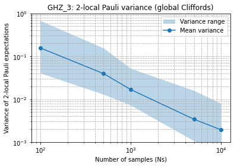
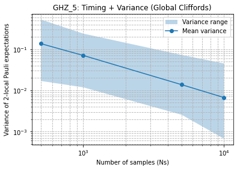

# Classical shadow tomography
Team: QFF foil

Quantum Fall Festival 2025.

# Abstract
Classical Shadow Tomography (CST) is a modern quantum algorithm designed to predict numerous physical quantities, or observables, of a quantum state using significantly fewer measurements than traditional methods. While Quantum State Tomography (QST) attempts to reconstruct the entire density matrix ($\rho$) of the quantum state and requires an exponential number of measurements, CST avoids the comprehensive reconstruction by in prior limiting calculated physical quantitie and only requires polynomial number of measurements, which leads to an efficient estimation of the physical quantities. This classical representation can be post-processed at any time to retrieve the values of various observables that meet specific conditions.

We demonstrated that CST achives efficient estimate of physical quantities of a quantum state through two intrigueing applications. First, we applied CST and QST to GHZ states to estimate expectations of any K-local Pauli observable and show that CST achives more acurate estimate of the local observable expectation with small number of shots than QST. We also show that QST estimate variance does not depend on the number of qubits and only depnds on locality of observable. 

# Code Description
- cluster_state_tomography_tensor_clifford.py: Classical Shadow Tomography for fidelity estimation of Cluster states using CL(2)**n as Unitary matrix ensemble. 

- cluster_state_tomography_n_qubit_clifford.py: Classical Shadow Tomography for fidelity estimation of Cluster states using CL(2^n) as unitary matrix ensemble.

- Low_Pauli_rank_stae_CST_Utsumi.ipynb : Analysis about efficiency Classical Shadow Tomography when density matrix of quantum system has a low rank.

# Result

The figures show the estimation of all two local paulis of 3 qubit GHZ state and 5 qubit GHZ state using n qubit clifford gate classical shadow. The lines respresent maximum, average and minimum of variance from true values out of all possobile two local paulis. We can see that the scaling does not change with repect to the number of qubits, which corraborates the theory.
# Member
@koizumiyuki
@makkuroym-ops
@TakeruUTSUMI
@wu-hao11
@okomenama
@ransan102

# Mentor
@Keisuke Murota
